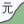

# Inflation Calculators

## Use

These inflation calculators are live online at
https://infl.at/
.

Each calculator immediately works in your browser,
but also then
can be installed from the browser to become an icon on your phone's home screen.

| &#x2003; | Country | Live At | Currency |
| --- | --- | --- | --- |
|  | US | https://infl.at/us/ | US$ |
|  | Canada | https://infl.at/ca/ | CA$ |
|  | Deutschland | https://infl.at/de/ | €, davor DM |
|  | United Kingdom | https://infl.at/uk/ | £ |
|  | France | https://infl.at/fr/ | €, avant cela F |
|  | Schweiz | https://infl.at/ch/ | Fr. |
|  | Österreich | https://infl.at/at/ | €, davor ÖS |
|  | India | https://infl.at/in/ | ₹ |
|  | 日本 | https://infl.at/jp/ | 円 |
|  | ישראל | https://infl.at/il/ | &#x2067;₪ אחרי ל״י&#x2069; |
|  | قطر | https://infl.at/qa/ | ر.ق |
|  | Philippines | https://infl.at/ph/ | ₱ |
|  | Chile | https://infl.at/cl/ | CLP$, antes de ese Eº |
|  | Botswana | https://infl.at/bw/ | P |
|  | Indonesia | https://infl.at/id/ | Rp |
|  | پاکستان | https://infl.at/pk/ | ₨ |
|  | لبنان | https://infl.at/lb/ | ⁧ل.ل.⁩ |
|  | 中国 | https://infl.at/cn/ | 元 |
|  | Brasil | https://infl.at/br/ | R$, e outros no passado |
|  | Nigeria | https://infl.at/ng/ | ₦, preceded by £ |
|  | বাংলাদেশ | https://infl.at/bd/ | ৳ |
|  | Australia | https://infl.at/au/ | $, preceded by £ |

## More Countries

If you send a pull request, your calculator can be online too.

First, to understand what you will have to change, compare existing directories,
for example with `diff de in` .
Then, you can work on your files in a specific country directory.
You can work on files even without running a server, without node or npm.

You can fork this repository to derive a calculator

- for another country,
- for a currency and its predecessor,
- with more current data,
- with further back data, or
- with a different appearance.

One difficulty level up is to derive a calculator

- between currencies of countries.

The US, Canadian, and Swiss inflation calculators have been configured for their
single currency, respectively.
A historical currency switch is handled correctly in the German and Austrian
calculators, as an example.
Two switches are handled in the French calculator, as an example.
The code for multiple currencies is present equally in all calculators.
The Canadian and Swiss calculators are multilingual.
Right to left writing is supported.

This calculator is optimized for certain uses.

Numbers and notes taken, if any, stay on a user's device only.
Nothing gets sent to a server.

We are grateful to the people who have collected and processed the
information the consumer price index is based on in their countries,
and to those who have funded those efforts.

## Purpose

One purpose of this project is understanding and getting along,
across generations.

For example,
for a grandparent to understand why a kid wants to spend $20 on a shirt,
when their own shirts used to be $3.
And, for a kid to understand what it means a grandparent worked for $2 per hour.

This also is for people whose activities have prevented them from
paying attention to some aspects of money.
Sometimes they have to pay attention.
These calculators hopefully help making sense of numbers changing in time.

This app was started as an exercise.

## Outlook

The initial organization and structure of this project had been chosen to fit
the phase it has been in.

Incremental changes are expected.

Better development documentation is intended to be written on demand.

## Internationalization Services

For help with internationalization and localization,
for education, training, consulting, development, automation, and testing,
write to i18n at infl dot at.

Internationalization is work that enables localization.
